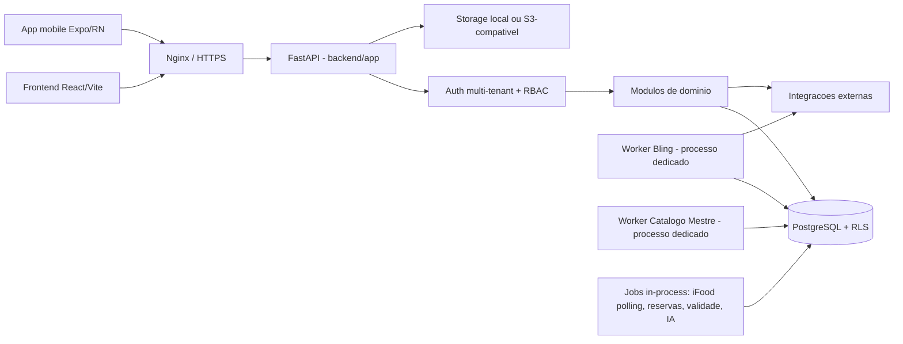

# Arquitetura

Fonte primária confirmada: `docs/ARQUITETURA.md` (documento oficial do projeto, atualizado em 2026-08-26) e três ADRs em `docs/adr/` (monólito modular, isolamento multitenant em camadas, escala orientada por medição). Este documento resume, cruza com o código real e aponta divergências. Ver [[README]], [[Tecnologias]], [[Banco-de-Dados]], [[Seguranca]].

## Visão geral (confirmado)

CorePet/Sistema Pet é um **SaaS multiempresa construído como monólito modular**: uma aplicação backend única (FastAPI), dividida internamente por domínios de negócio, não por microsserviços.



## Componentes (confirmado, `backend/app/main.py` como entrada)

| Componente | Responsabilidade | Fonte |
|---|---|---|
| Backend | API, auth, regras, integrações | `backend/app/` — entrada `main.py`, registro de rotas em `main_routers.py` (~90 `include_router`) |
| Frontend web | ERP no navegador | `frontend/src/` — ver [[Funcionalidades]] |
| Mobile | App de tutores/veterinários | `app-mobile/src/` |
| PostgreSQL | Dados + isolamento multiempresa | ver [[Banco-de-Dados]] |
| Worker Bling | Processo dedicado — sync de estoque/pedidos/NF | `backend/scripts/run_bling_worker.py` |
| Worker Catálogo Mestre | Processo dedicado — enriquecimento contínuo do catálogo global de produtos | `backend/scripts/run_catalogo_mestre_worker.py` |
| Nginx | HTTPS, proxy, entrega do frontend | `nginx/` |
| CI | Testes, lint, build, segurança, migrations | `.github/workflows/`, ver [[CI-CD]] |

⚠️ **Divergência confirmada com `docs/ARQUITETURA.md`**: o documento oficial cita apenas o "Worker Bling" como processamento fora da requisição. O código mostra dois processos dedicados adicionais e vários jobs in-process não documentados ali — ver seção seguinte.

## Fluxo de uma requisição (confirmado)

1. Navegador/app chama rota HTTPS.
2. Nginx encaminha para o backend.
3. Middlewares aplicam CORS, rate limiting básico, request ID, logs, tratamento de erro (`backend/app/main_http.py`).
4. Autenticação valida usuário/sessão/tenant via JWT (`backend/app/auth/dependencies.py`).
5. Dependency de permissão valida RBAC por tenant (`backend/app/security/permissions_service.py`).
6. Rota delega para service/queries do domínio.
7. SQLAlchemy executa contra Postgres, com filtro de tenant automático e RLS.
8. Resposta HTTP volta ao cliente.

Ver detalhe completo em [[Autenticacao]] e [[Autorizacao]].

## Processamento fora da requisição (confirmado no código — complementa `docs/ARQUITETURA.md`)

Não há Celery em uso (apesar de estar no `requirements.txt`). Três mecanismos reais, todos confirmados:

1. **Processos dedicados separados** (fora do processo da API):
   - `backend/scripts/run_bling_worker.py` — sincronização Bling, com heartbeat em arquivo.
   - `backend/scripts/run_catalogo_mestre_worker.py` — enriquecimento do catálogo mestre, heartbeat próprio. **Não mencionado em `docs/ARQUITETURA.md`.**
2. **Jobs in-process com eleição de líder** (`backend/app/main_background_jobs.py`, líder por `fcntl` em Linux; sempre líder no Windows/dev):
   - Renovação de token Bling (a cada 5h)
   - Expiração de reservas de pedido (30 min)
   - Proteção de estoque por validade (6h, flag `ESTOQUE_VALIDADE_SCHEDULER_ENABLED`)
   - Sync de evidência clínica veterinária via PubMed (semanal, flag `VET_EVIDENCE_SYNC_ENABLED`, desligado por padrão)
   - Sync de catálogo regulatório DailyMed/VMD (semanal, flag `VET_REGULATORY_SYNC_ENABLED`, desligado por padrão)
   - Polling de pedidos iFood (30s, 2 flags de ativação)
   - Sync SEFAZ — **código presente mas inerte**: `_loop_sefaz_sync` retorna imediatamente (`main_background_jobs.py:251-260`), preservado como histórico
3. **APScheduler dentro do processo líder**: `CampaignScheduler` (`campaigns/scheduler.py`) e `BlingSyncScheduler` (`schedulers/bling_sync_scheduler.py`, flag `BLING_SYNC_SCHEDULER_ENABLED`).

Filas de processamento assíncrono (`campaign_event_queue`, `notification_queue`, fila de webhook de pedido Bling) são **tabelas PostgreSQL** com padrão `SELECT FOR UPDATE SKIP LOCKED`, não Redis/Celery.

## Multiempresa (confirmado — ver [[Banco-de-Dados]] e [[Autorizacao]] para o detalhe técnico)

Isolamento em camadas complementares, confirmado no código (não apenas documentado):

- tenant resolvido no login/seleção de empresa e embutido no JWT;
- dependency de autenticação extrai `tenant_id` do token em toda requisição;
- filtro automático de query no SQLAlchemy (`backend/app/tenancy/filters.py`) — levanta erro se uma tabela multiempresa for consultada sem tenant no contexto;
- Row Level Security real no PostgreSQL (~28 migrations com `ENABLE/FORCE ROW LEVEL SECURITY` + `CREATE POLICY`);
- exceções documentadas e restritas (filas cross-tenant, cockpit admin) em whitelist explícita no próprio filtro.

## Backend modular — padrão documentado vs. prática real (divergência confirmada)

`docs/BLUEPRINT_BACKEND.md` define um padrão-alvo por domínio:

```text
backend/app/<dominio>/
|- routes.py
|- schemas.py
|- services.py
|- queries.py
|- events.py
```

⚠️ **Na prática**, a maior parte do backend legado está em arquivos "flat" na raiz de `backend/app/` (dezenas de arquivos `banho_tosa_*.py`, `estoque_*.py`, `comissoes_*.py`, etc.), **não** na estrutura de pasta por domínio. Apenas domínios mais novos (`vendas/`, `clientes/`, `produtos/`, `campaigns/`, `intnfe/`) seguem o padrão de pasta. Isso é dívida técnica de organização, não um problema funcional confirmado — ver [[Pendencias]].

## Módulos ligáveis por tenant (confirmado)

Muitos routers são registrados com `dependencies=_module_dependencies("<modulo>")` — controle de módulos habilitados por plano/tenant. Módulos identificados: `veterinario`, `banho_tosa`, `fiscal`, `financeiro_erp`, `bling`, `compras`, `rh`, `entregas`, `whatsapp`, `campanhas`, `ecommerce`. Isso é a base do modelo comercial "SaaS com módulos contratáveis" — ver [[Funcionalidades]].

## Execução e deploy (confirmado — detalhe em [[CI-CD]])

- **Desenvolvimento**: Docker Compose (Postgres + backend) + Vite local.
- **Homologação**: ambiente `corepet-homolog`, descartável, com Dockerfiles de produção e dados fictícios.
- **Produção**: deploy manual autorizado, script `scripts/deploy_producao_seguro.sh`, único servidor via SSH.

## Qualidade e segurança de mudança (confirmado, `docs/ARQUITETURA.md`)

Toda mudança deve preservar: isolamento entre empresas, autenticação/permissões, consistência de dinheiro/estoque/fiscal, idempotência, contratos HTTP (web + mobile), migrations reprodutíveis, logs sem segredos, rollback conhecido.

## Não identificado

- ⚠️ Não identificado no código analisado: motivo específico pelo qual `intnfe/` (ativação/CSC/numeração) e `nfe/`+`nfe_routes.py` (emissão/DANFE/sync SEFAZ) coexistem como dois sistemas fiscais — se são legado vs. novo, ou complementares por função. ❓ Necessita validação com o responsável.
- ❓ Critério objetivo que dispararia a extração de um serviço do monólito (o ADR-0001 menciona "evidência de medição", mas não há métrica hoje coletada que sirva de gatilho concreto).
