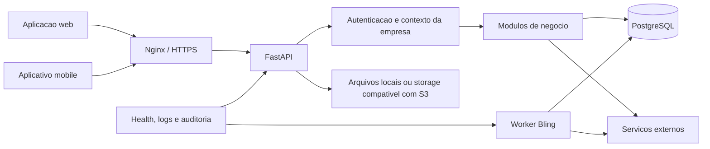

# Arquitetura do CorePet

Atualizado em: 2026-08-20

Status: documento oficial da arquitetura atual.

Este documento explica como o sistema funciona por dentro. Ele descreve o que
existe hoje; planos futuros devem ser registrados separadamente.

## Visao geral

O CorePet e um SaaS multiempresa construido como monolito modular. Isso
significa que existe uma aplicacao principal de backend, dividida internamente
por dominios como vendas, estoque, financeiro, ecommerce e veterinario.

Esse desenho reduz a complexidade operacional no estagio atual e permite
evolucao gradual. Separar servicos e infraestrutura so deve ocorrer quando uma
medicao demonstrar um gargalo ou uma necessidade clara de isolamento.



## Componentes

| Componente | Responsabilidade | Fonte oficial |
|---|---|---|
| Backend | API, autenticacao, regras, auditoria e integracoes | `backend/app/` |
| Frontend | ERP executado no navegador | `frontend/src/` |
| Mobile | Aplicativo de clientes e perfis operacionais | `app-mobile/src/` |
| PostgreSQL | Dados transacionais e isolamento multiempresa | migrations em `backend/alembic/versions/` |
| Worker Bling | Filas, webhooks e reconciliacoes da integracao | `backend/scripts/run_bling_worker.py` e modulos Bling |
| Nginx | HTTPS, proxy da API e arquivos do frontend | `nginx/` |
| CI | Testes, lint, build, seguranca e migrations | `.github/workflows/` |
| Operacao | Deploy, backup, restore, health e watchdog | `scripts/` |

## Fluxo de uma requisicao

1. O navegador ou aplicativo chama uma rota HTTPS.
2. O Nginx encaminha a chamada para o backend.
3. Middlewares aplicam seguranca, identificador da requisicao, CORS, logs e
   tratamento de erros.
4. A autenticacao valida usuario, sessao, permissoes e empresa ativa.
5. A rota converte a entrada e delega a regra para o modulo de negocio.
6. Services e queries executam a operacao no PostgreSQL.
7. Auditoria e eventos registram efeitos sensiveis quando aplicavel.
8. A API devolve um contrato HTTP estavel para o cliente.

## Multiempresa

Empresa tambem e chamada de `tenant` no codigo. O isolamento possui camadas
complementares:

- tenant selecionado na autenticacao e presente no contexto da requisicao;
- dependencias de autenticacao e permissao no backend;
- filtros e modelos com `tenant_id`;
- contexto do tenant sincronizado com a sessao de banco;
- Row Level Security no PostgreSQL para tabelas multiempresa cobertas;
- testes de isolamento em `backend/tests/multi_tenant/`;
- auditoria que impede novas tabelas multiempresa sem a protecao esperada.

Rotas administrativas globais sao excecoes explicitas e devem permanecer
restritas, auditadas e testadas.

## Backend modular

O backend usa FastAPI e SQLAlchemy. `backend/app/main.py` deve permanecer como
composicao da aplicacao, nao como local de regras de negocio.

Padrao preferencial para um dominio:

```text
backend/app/<dominio>/
|- routes.py         HTTP, auth, permissao e serializacao
|- schemas.py        entradas e saidas
|- services.py       regras e orquestracao
|- queries.py        consultas compartilhadas ou complexas
|- events.py         eventos e auditoria, quando aplicavel
`- ...
```

Arquivos de compatibilidade podem reexportar nomes antigos durante uma
refatoracao. Eles devem ser pequenos e apontar para a implementacao modular.

## Frontend modular

O frontend usa React e Vite. Rotas e carregamento de paginas ficam em
`frontend/src/app/`. Regras reutilizaveis devem sair de componentes grandes e
ir para hooks, services ou utils testaveis.

Padrao preferencial:

```text
frontend/src/<feature>/
|- index.js          superficie publica
|- pages/            telas roteaveis
|- components/       apresentacao
|- hooks/            estado e efeitos
|- services/         chamadas HTTP e adaptadores
`- utils/            funcoes puras
```

Regra de negocio financeira, fiscal ou de estoque nao deve existir apenas no
frontend. O backend e a autoridade final para operacoes sensiveis.

## Dados e transacoes

- PostgreSQL e o banco oficial dos ambientes compartilhados.
- SQLAlchemy gerencia sessoes e acesso aos dados.
- Alembic registra toda mudanca estrutural.
- Alteracoes de banco devem ser compativeis com a versao em execucao durante o
  deploy sempre que houver risco de transicao.
- Dados de desenvolvimento nunca sao enviados para producao.
- Backup e restore fazem parte do procedimento operacional, nao do codigo da
  funcionalidade.

## Processamento fora da requisicao

O worker Bling possui processo proprio em producao para reduzir trabalho pesado
dentro da API. Jobs adicionais ainda podem existir no ciclo de vida do backend;
eles devem ter idempotencia, coordenacao entre workers, heartbeat e auditoria
quando forem criticos.

Uma nova fila ou novo servico separado exige motivo documentado. Ter muitos
servicos nao e, por si so, sinal de escala ou qualidade.

## Arquivos e imagens

O backend aceita armazenamento local e configuracao compativel com S3 para
imagens de produtos. Arquivos operacionais nao pertencem ao Git. O repositorio
guarda apenas codigo, configuracoes de exemplo e arquivos publicos necessarios
ao build.

## Execucao e deploy

### Desenvolvimento

O ambiente local usa Docker Compose para PostgreSQL e backend, com frontend
executado pelo Vite conforme os scripts oficiais. O guia e
`docs/DEV_ENVIRONMENT_CHECK.md`.

### Producao

O deploy oficial parte de um commit aprovado na `main`, gera o frontend,
reconstroi o backend e o worker, aplica migrations e valida health. O unico guia
operacional e `docs/PRODUCAO_DEPLOY_SSH.md`.

Nenhuma descricao arquitetural autoriza deploy. Producao exige autorizacao
explicita do responsavel.

## Qualidade e seguranca de mudanca

Toda mudanca deve preservar estas garantias:

- isolamento entre empresas;
- autenticacao e permissoes;
- consistencia de dinheiro, estoque e fiscal;
- idempotencia de operacoes que podem ser repetidas;
- contratos HTTP usados pelo web e pelo mobile;
- migrations reproduziveis;
- logs sem segredos ou dados sensiveis desnecessarios;
- caminho de rollback conhecido.

CI executa suites de backend, multiempresa, migrations, lint, formatacao,
auditorias e build do frontend. Suites focadas continuam obrigatorias antes de
fechar cada tarefa.

## Capacidade e escala

Escala e uma propriedade medida, nao uma conclusao obtida apenas pelo desenho.
Antes de ampliar uma faixa de clientes, devem existir cenarios de carga para
login, vendas, estoque, listagens, relatorios e integracoes, com metas de erro,
latencia e uso do banco.

O monolito modular pode crescer vertical e horizontalmente. Extracao de um
servico deve acontecer quando uma medicao mostrar que um dominio precisa de
escala, isolamento de falha ou ciclo de deploy proprio.

## Evolucao segura da arquitetura

Mudancas estruturais seguem
`docs/auditorias/estrutura-geral-definition-of-done.md`:

1. registrar o comportamento atual com testes;
2. escolher uma fatia pequena;
3. preservar rotas, payloads, tenant, permissoes e auditoria;
4. mover codigo sem misturar nova regra;
5. executar testes focados e gates gerais;
6. registrar a decisao no PR.

Reescrita total nao e a estrategia padrao. Refatoracao incremental reduz risco
para empresas que ja utilizam o sistema.
