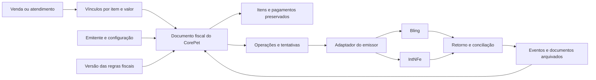
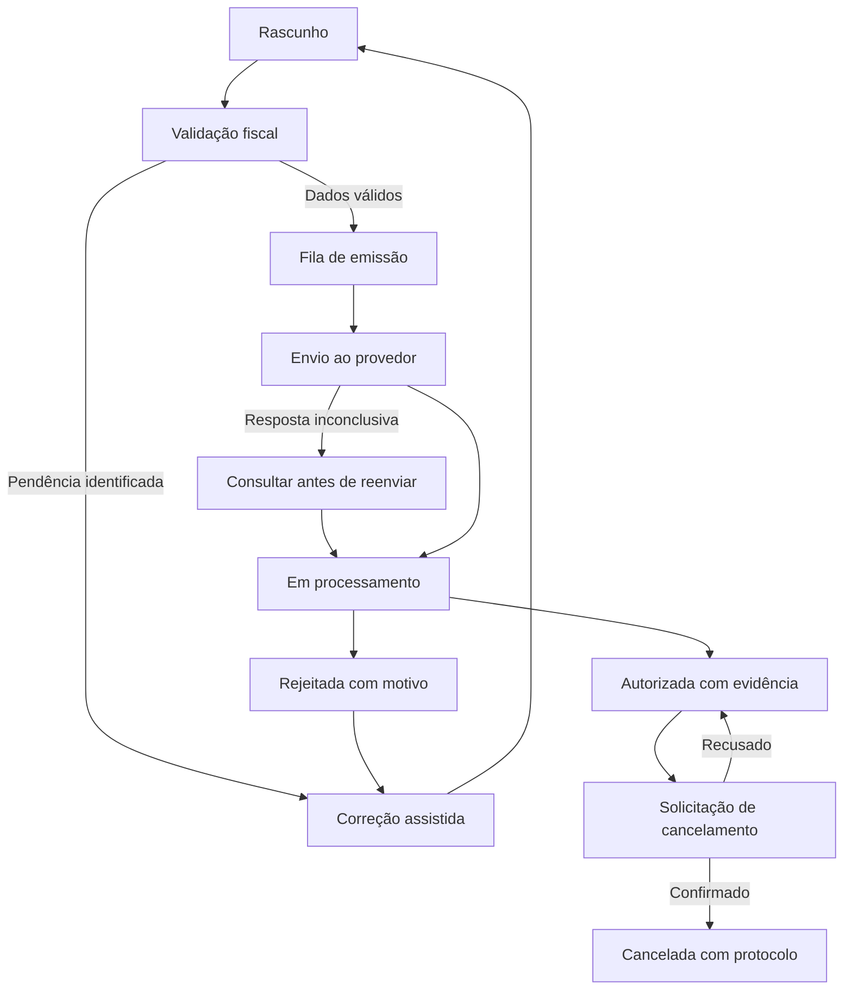

# Emissão fiscal no CorePet — estudo do Bling e proposta de estrutura

Data da análise: 09/09/2026. Status: proposta para implementação, sem alteração de código ou banco.

**Atualização após o retorno do Lucas e do irmão, em 09/09/2026:** o próximo passo é obter acesso à IntNFe, cadastrar/vincular a empresa de teste e emitir uma NF-e simples de produto em homologação. As demais dúvidas orientam desenvolvimento futuro após os testes preliminares. O [roteiro do piloto](FISCAL_INTNFE_PILOTO_HOMOLOGACAO.md) registra a decisão, as pendências imediatas e a releitura mais recente da documentação. As etapas de construção do módulo abaixo não são pré-requisitos para esse primeiro teste externo.

**Recomendação: criar um módulo fiscal próprio do CorePet, com notas e histórico independentes da venda, e conectar cada emissor por um adaptador.** O Bling serve de referência funcional; a IntNFe é uma candidata a executar a emissão. A escolha do fornecedor não deve determinar o formato dos dados internos do CorePet.

O primeiro recorte pode ser uma empresa, uma operação de venda de mercadorias e um emissor. Entretanto, o desenho já deve comportar NFC-e, NFS-e, documentos recebidos e vínculos entre notas. Ter espaço no modelo não significa liberar todas essas operações no primeiro lançamento.

## Alcance e evidências

Foram consultados a documentação oficial da API v3, artigos de operação e configuração do Bling, a revisão da IntNFe feita nesta tarefa e o código local do CorePet. Não houve acesso à conta privada do Bling, emissão, cancelamento, mudança de configuração ou teste autenticado da API.

Referência do código versionado: commit `6a5eaa13ad62269432939067cbb39684e4785069`. Havia alterações de outras atividades em arquivos de notas durante a análise. As observações sobre o legado precisam ser reconferidas depois que essas alterações forem concluídas. Em particular, já apareceu um novo módulo local de documentos; não se deve abrir uma segunda implementação concorrente.

O OpenAPI atual foi localizado pelo JavaScript carregado pela [referência oficial](https://developer.bling.com.br/referencia), e não por uma cópia antiga encontrada em busca. Arquivo consultado: [openapi-DKXp8d1e.json](https://developer.bling.com.br/build/assets/openapi-DKXp8d1e.json). O nome desse arquivo pode mudar; a página de referência é o ponto de entrada duradouro.

## 1. O que aprendemos com o Bling

O formulário de NF-e reúne identificação da operação, destinatário, itens, impostos, transporte, pagamentos e observações. A natureza de operação influencia a tributação, e há finalidades diferentes de venda normal. [Cabeçalho da nota](https://ajuda.bling.com.br/hc/pt-br/articles/360035907793-Como-preencher-os-dados-da-nota-fiscal)

Frete, seguro, desconto e outras despesas participam dos totais. Dados logísticos incluem transportador, volumes e endereço de entrega. Parcelas possuem vencimento, valor e forma de pagamento. Isso orienta os grupos de dados que precisamos preservar. [Totais](https://ajuda.bling.com.br/hc/pt-br/articles/360035809554-Entendendo-a-se%C3%A7%C3%A3o-C%C3%A1lculo-de-Imposto-nas-notas-fiscais-do-Bling) · [Transporte](https://ajuda.bling.com.br/hc/pt-br/articles/360035811434-Como-preencher-os-dados-do-Transportador-na-nota-fiscal) · [Pagamento](https://ajuda.bling.com.br/hc/pt-br/articles/360036304293-Como-preencher-as-informa%C3%A7%C3%B5es-de-Pagamento-na-nota-fiscal)

No contrato consultado, NF-e, NFC-e e NFS-e possuem recursos próprios. Cadastro e envio são separados. Há operações específicas de lançamento e estorno de contas e estoque. O tipo de movimentação, entrada/saída, não é o modelo 55/65. O documento da NF-e pode ser obtido pela chave, em XML ou PDF. [API v3](https://developer.bling.com.br/referencia)

Para NFC-e, a configuração contempla ambiente, CSC e identificador, natureza padrão e automatismos de estoque/contas. Precisamos verificar esses automatismos ao integrar uma conta, para que a emissão não duplique efeitos da venda. [Configuração da NFC-e](https://ajuda.bling.com.br/hc/pt-br/articles/360035805954-Como-configurar-o-sistema-para-emiss%C3%A3o-de-NFC-e)

NFS-e possui dados específicos de serviços, município, tributos e identificação do documento. A cobertura do Bling varia por município e situação da integração; não se deve transformar a existência de uma API em promessa de cobertura nacional. [Formulário de serviços](https://ajuda.bling.com.br/hc/pt-br/articles/360037770273-Como-preencher-o-formul%C3%A1rio-da-Nota-de-Servi%C3%A7o) · [Cobertura, atualizada em 04/09/2026](https://ajuda.bling.com.br/hc/pt-br/articles/360039971653-Lista-de-Prefeituras-que-possuem-integra%C3%A7%C3%A3o-com-o-Bling-para-emiss%C3%A3o-de-NFS-e)

As configurações fiscais atuais do Bling já incluem IBS/CBS e regras condicionadas por operação. Para serviços também aparecem classificação nacional e NBS. Nossa proposta deve guardar a versão da regra aplicada e permitir evolução dos campos, sem copiar alíquotas de exemplo como padrão universal. [Configuração dos novos tributos](https://ajuda.bling.com.br/hc/pt-br/articles/35705278410775-Onde-configurar-os-tributos-da-Reforma-Tribut%C3%A1ria-no-Bling)

Os webhooks do Bling têm assinatura, identificador do evento e empresa. Podem chegar repetidos e fora de ordem. A documentação prevê tentativas durante até três dias e desativação da configuração após falhas persistentes; resposta de sucesso precisa chegar em até cinco segundos. [Webhooks](https://developer.bling.com.br/webhooks)

**Conclusão de desenho:** precisamos controlar o documento, a comunicação com o fornecedor e os efeitos comerciais como responsabilidades distintas.

## 2. Base que já existe no CorePet

| Área | Evidência local | Como aproveitar |
|---|---|---|
| Fiscal da empresa | [EmpresaConfigFiscal](C:/Users/lcs_g/Sistema-Pet/backend/app/empresa_config_fiscal_models.py) | Usar o cadastro existente como origem; acrescentar configuração de emissão e regras versionadas. |
| Fiscal dos produtos | [ProdutoConfigFiscal](C:/Users/lcs_g/Sistema-Pet/backend/app/produto_config_fiscal_models.py), configurações de kits e variações | Reaproveitar NCM, CEST, origem, CFOP e códigos tributários; validar completude e exceções. |
| Vendas e recebimentos | [Venda e itens](C:/Users/lcs_g/Sistema-Pet/backend/app/vendas_models.py) | Continuam sendo a origem comercial. Os campos `nfe_*` atuais são uma ponte de compatibilidade. |
| Consulta de notas externas | [BlingNotaFiscalCache](C:/Users/lcs_g/Sistema-Pet/backend/app/nfe_cache_models.py) | Reaproveitar listagem e importação; o cache não deve ser o único registro fiscal definitivo. |
| Interface de notas | [CentralNFSaida](C:/Users/lcs_g/Sistema-Pet/frontend/src/pages/CentralNFSaida.jsx) e [detalhes](C:/Users/lcs_g/Sistema-Pet/frontend/src/pages/centralNFSaida/NFSaidaDetalhesModal.jsx) | Evoluir a tela existente, acrescentando fila, eventos, pendências e documentos por modelo. |
| Compras e XML recebido | [NotaEntrada e itens](C:/Users/lcs_g/Sistema-Pet/backend/app/produtos_compras_models.py) | Preservar importação, conferência e recebimento de compras; vincular ao catálogo fiscal sem reprocessar estoque. |
| Integração e credenciais | [BlingConnection](C:/Users/lcs_g/Sistema-Pet/backend/app/bling_connection_models.py) e [cliente Bling](C:/Users/lcs_g/Sistema-Pet/backend/app/bling_integration_parts/core.py) | Reutilizar o padrão de credenciais protegidas e contexto da empresa. |
| Reconciliação operacional | [Reconciliação de NF autorizada](C:/Users/lcs_g/Sistema-Pet/backend/app/services/nfe_authorized_reconciliation_service.py) e [cancelamento/estoque](C:/Users/lcs_g/Sistema-Pet/backend/app/services/pedido_cancelamento_fiscal_estoque_service.py) | Preservar as regras por origem de pedido e migrar gradualmente para eventos do módulo fiscal. |
| Serviços | [Planejamento de NFS-e integrada](C:/Users/lcs_g/Sistema-Pet/docs/NFSE_INTEGRADA_PRODUTO.md) | Aproveitar ativação, cobertura municipal e jornada de Veterinário/Banho & Tosa; continua sendo planejamento, não comprovação de emissão funcionando. |

### Pontos do legado a revisar antes de reaproveitar a emissão

1. **Semântica do pedido ao Bling:** o adaptador versionado escolhe `tipo` pelo modelo da nota e envia `situacao = 0`. Isso diverge da descrição atual desses campos na API. Revalidar o corpo completo de criação, inclusive campos somente de leitura, datas e numeração. [Adaptador](C:/Users/lcs_g/Sistema-Pet/backend/app/bling_integration_parts/notas.py) · [Contrato](https://developer.bling.com.br/referencia)
2. **Natureza fixada no código:** há uma referência específica de natureza de operação embutida no adaptador. Deve virar configuração da empresa/operação, validada para a conta conectada; nunca um ID compartilhado entre clientes.
3. **Chamadas sem correspondência no OpenAPI consultado:** o legado contém rotas de XML, DANFE, cancelamento e CC-e para NF-e que não aparecem com esse formato no contrato público atual. A ausência não comprova falha de produção, mas exige confirmação. Não presumir que um botão pronto significa capacidade homologada. [Cliente legado](C:/Users/lcs_g/Sistema-Pet/backend/app/bling_integration_parts/notas.py)
4. **Documentos em evolução:** o arquivo local [documentos.py](C:/Users/lcs_g/Sistema-Pet/backend/app/nfe/documentos.py) já estava sendo criado por outra atividade e usa links retornados na consulta. Integrar esse trabalho à revisão; não duplicar a solução. Seu resultado ainda não foi validado por este estudo.
5. **Cálculo simplificado:** [pdv_fiscal_calculo.py](C:/Users/lcs_g/Sistema-Pet/backend/app/services/pdv_fiscal_calculo.py) contém ICMS-ST simplificado em 10% da base. Essa função não pode ser promovida a motor de tributação da emissão. A regra fiscal precisa vir de configuração revisada e de cálculo adequado ao cenário.
6. **Histórico concentrado na venda:** um conjunto de campos `nfe_*` não descreve várias notas, tentativas e eventos. Limpar uma referência da venda não pode apagar a memória de uma emissão anterior.

Esses itens são achados de leitura e requisitos de revisão, não um diagnóstico de incidentes reais. Nenhuma chamada autenticada foi executada para reproduzi-los.

## 3. Estrutura proposta para o nosso módulo fiscal

Os nomes abaixo são propostas internas. Não são cópias das tabelas do Bling nem migrations já aplicadas.

| Componente | O que deve guardar | Garantia principal |
|---|---|---|
| Emitente fiscal | Empresa, estabelecimento/CNPJ, inscrições, endereço, município e regime | Uma nota identifica explicitamente quem emite; começar com um estabelecimento por cliente. |
| Conexão do emissor | Provedor, conta externa, referências seguras de credenciais/certificado, capacidades e homologação | Bling e IntNFe podem ter capacidades distintas; ativação por empresa e modelo. |
| Configuração de emissão | Ambiente, família do documento, série, responsável pela numeração e dados específicos como CSC/RPS/DPS | Separar homologação de produção e identificar quem controla a sequência. |
| Perfil e versão fiscal | Natureza, finalidade, critérios por destino/produto/serviço, vigência, revisão e responsável | Reconstituir quais regras foram usadas; impedir padrões genéricos silenciosos. |
| Documento fiscal | ID interno, família, direção, finalidade, ambiente, série/número, identificação externa, status e totais | A nota existe independentemente da disponibilidade do fornecedor. |
| Itens fiscais | Cópia dos dados emitidos, quantidades, unidade comercial/tributável, preços, rateios, classificação e tributos | Alterar o cadastro de produto depois não altera o histórico da nota. |
| Vínculos com origens | Venda, item da venda, atendimento, pedido ou recebimento e parcela de quantidade/valor documentada | Uma venda pode gerar documentos diferentes, sem documentar a mesma parcela duas vezes. |
| Pagamentos e parcelas fiscais | Meio de pagamento fiscal, valor, vencimento, troco/retenções quando aplicáveis e vínculo comercial | Declarar pagamento na nota não cria outro recebimento de caixa. |
| Relações entre documentos | Nota original, devolução, complemento, substituição ou outras referências permitidas | Preservar a cadeia documental, inclusive referências externas. |
| Operações e tentativas | Emissão/cancelamento/consulta, chave de idempotência, versão enviada, situação, tentativa e erro | Distinguir falha comprovada de resultado desconhecido. |
| Eventos fiscais e notificações | Evento recebido, autenticidade, origem, data, protocolo, sequência e processamento | Deduplicar avisos e manter histórico sem regressão de estado. |
| Arquivos fiscais | XML autorizado, documentos auxiliares, XML/protocolo de eventos, formato, hash e localização protegida | O histórico não depende de um link temporário do fornecedor. |

Não é necessário criar uma tabela para cada linha imediatamente. Os grupos pequenos podem começar como dados estruturados versionados; identidades, vínculos, operações e eventos precisam de restrições próprias no banco. O detalhamento físico deve acompanhar o primeiro recorte de implementação.

### Regras dos dados

- Todas as entidades operacionais pertencem à empresa autenticada. Usar filtros, RLS e vínculos que impeçam cruzar empresas também nos itens, arquivos e eventos.
- Guardar identificadores externos como texto. O ID de um fornecedor não é o número da nota e não deve ser a chave primária do CorePet.
- Separar família (`nfe`, `nfce`, `nfse`), modelo quando aplicável, direção (`entrada`, `saida`), finalidade e canal comercial. Loja física/online não é modelo fiscal.
- Para NFS-e, permitir identificação própria do município/padrão, número, verificação, RPS ou DPS quando aplicáveis; não impor o formato de chave da NF-e a todo documento.
- Usar valores decimais e política explícita de arredondamento/rateio. Conferir centavos entre itens, descontos, transporte, tributos e pagamentos.
- Preservar cópias dos dados do emitente, destinatário e itens em cada versão submetida. Alterações de rascunho são auditadas; XML autorizado permanece imutável.
- A chave de acesso deve ser única no contexto da empresa/ambiente quando existir. O vínculo externo inclui empresa, conexão, ambiente, família e ID remoto.
- A numeração tem uma autoridade por emitente/ambiente/modelo/série. Se a IntNFe atribui o número, o CorePet registra o resultado e não disputa a sequência com ela. A troca de emissor exige conciliação das séries.
- A venda não tem uma restrição de “uma única nota para sempre”. O bloqueio de duplicidade é por intenção fiscal e parcela documentada, distinguindo emissão, complemento e devolução.

## 4. Estados e fluxo de emissão

Guardar separadamente **situação fiscal**, **situação da comunicação** e **modo de emissão**. Uma nota autorizada continua autorizada enquanto um pedido de cancelamento aguarda resultado. Contingência é um modo de operação com evidências próprias, não sinônimo automático de sucesso ou falha.

O diagrama é o caminho mínimo proposto, não o catálogo completo de situações legais. Ocorrências excepcionais devem preservar o código original do provedor e cair em consulta/tratamento assistido.

O adaptador traduz as situações de cada provedor. Não compartilhar um mapa numérico entre Bling NF-e, Bling NFS-e e IntNFe. Guardar o status bruto para diagnóstico. “Arquivo disponível”, “DANFE gerado” ou HTTP de sucesso, isoladamente, não bastam para declarar autorização.

### Proteção contra duplicidade

1. Registrar a intenção fiscal e a versão do conteúdo antes de qualquer envio.
2. Impor uma chave única para essa intenção e bloquear dois trabalhadores executando-a ao mesmo tempo.
3. Persistir uma operação pendente na mesma transação do documento; o processamento externo começa depois da confirmação dessa transação.
4. Usar a idempotência do provedor quando ela existir e estiver comprovada. A proteção local, sozinha, não resolve uma resposta perdida depois da emissão externa.
5. Se o resultado for desconhecido, consultar/reconciliar antes de emitir outra vez. Também não trocar automaticamente de fornecedor nesse estado.
6. Relacionar IDs de emissão e eventos à operação correta. Uma nota pode ter vários eventos legítimos; deduplicar só pelo ID da nota descartaria atualizações necessárias.
7. Rejeição corrigida gera uma nova versão auditada conforme o comportamento de numeração do provedor. Não reutilizar uma chave de idempotência com conteúdo diferente.

### Estoque, caixa e financeiro

Para uma venda já finalizada no PDV, anexar uma nota não deve baixar novamente estoque, gerar outra conta a receber ou registrar outro pagamento. Para pedido importado cuja regra atual movimenta estoque a partir da nota, manter esse comportamento explicitamente por origem e deduplicar o efeito. Não aplicar uma regra única sem migrar os fluxos existentes.

Cancelamento fiscal não significa devolução física nem estorno financeiro automático. Registrar essas operações separadamente e ligar suas evidências. A situação fiscal não deve sobrescrever silenciosamente a situação da venda.

Exemplo de cenário de teste, não regra tributária: uma venda de R$ 150,00 contém R$ 100,00 de mercadoria e R$ 50,00 de serviço. A configuração homologada pode direcionar esses itens a documentos diferentes. O recebimento comercial continua em R$ 150,00; frete, desconto e pagamento precisam ser distribuídos sem duplicação ou centavos perdidos. O enquadramento e o momento de emissão de cada item serão definidos com a contabilidade.

## 5. Telas e jornadas propostas

| Tela/jornada | Conteúdo necessário | Prioridade |
|---|---|---|
| Configuração fiscal da empresa | Dados cadastrais, emissor, cobertura, ambiente, certificados/CSC conforme modelo, séries e homologação | Primeiro recorte |
| Pendências fiscais | Produtos/clientes/serviços incompletos, certificado vencendo, natureza não configurada; motivo e atalho para correção | Primeiro recorte |
| Emissão a partir da venda | Destinatário, itens selecionados, valores e totais, natureza/finalidade, revisão e envio | Primeiro recorte |
| Central fiscal | Filtros por período, família, emitente, situação, origem; fila, busca por chave/número e ações permitidas | Evoluir CentralNFSaida |
| Detalhe da nota | Dados preservados, situação, histórico, vínculo comercial, XML/PDF, protocolo, rejeição e consulta | Primeiro recorte |
| Eventos | Cancelamento com justificativa, CC-e onde disponível, devolução e documentos referenciados | Cancelamento no piloto; demais por capacidade |
| Serviços | Tomador, local/competência, código de serviço, ISS/retenções, regras vigentes e vínculo com atendimento | Após cobertura municipal validada |
| Contador e arquivo | Exportação por período/CNPJ/modelo, XMLs e eventos, registro de exportação | Antes de expansão comercial |

Permissões propostas: consultar, preparar rascunho, emitir, cancelar, corrigir configuração, exportar e administrar credenciais. Ações precisam ser validadas no backend, além da visibilidade dos botões.

A tela deve informar por que uma ação está indisponível: falta de configuração, situação incompatível, permissão ou capacidade ausente no emissor. Pagamento do adicional não libera emissão antes da validação fiscal, conforme o planejamento existente de NFS-e.

## 6. Contrato do CorePet com os emissores

Interface proposta, dentro do backend modular existente:

| Operação | Resultado esperado |
|---|---|
| `consultar_capacidades` | Famílias, operações, municípios/UFs, limites e restrições comprovadas para a conexão |
| `validar_configuracao` | Pendências específicas da empresa e do ambiente |
| `preparar_documento` | Representação do envio, versão do contrato e validações; não transmite |
| `emitir` | Operação aceita/concluída ou falha comprovada, ID remoto e indicação de resultado desconhecido quando necessário |
| `consultar` | Situação normalizada, estado bruto, protocolos e documentos disponíveis |
| `solicitar_evento` | Operação própria de cancelamento/CC-e/etc., somente se suportada |
| `obter_documentos` | Arquivos verificados e metadados de origem |
| `interpretar_notificacao` | Identidade autenticada da empresa, evento deduplicável e ação de conciliação |

Usar o monólito modular e os padrões de trabalho em segundo plano já existentes. Não há evidência neste estudo que justifique criar outro serviço de infraestrutura. [Arquitetura atual](C:/Users/lcs_g/Sistema-Pet/docs/ARQUITETURA.md)

O catálogo de capacidades deve distinguir **documentado**, **testado em homologação**, **habilitado para a empresa** e **indisponível**. Uma integração não passa diretamente do primeiro para o terceiro estado.

Para o Bling, emissão/consulta das três famílias aparecem no contrato. Cancelamento de NFS-e está documentado; cancelamento/CC-e de NF-e requerem confirmação de contrato antes de prometer execução integrada. Recursos de tela e API não são necessariamente equivalentes. [API oficial](https://developer.bling.com.br/referencia)

Para a IntNFe, a revisão encontrou emissão de NF-e e seus eventos, mas não confirmou NFC-e/NFS-e. A releitura após o retorno do irmão já documenta `Idempotency-Key`, listagem para reconciliação, XML dos eventos, desconto, frete e mais situações de ICMS/ICMS-ST. Esses pontos passam de ausência documental para validação prática pendente. A documentação ainda informa limitações tributárias, incluindo ausência de IBS/CBS. Ver a atualização detalhada no [roteiro do piloto](FISCAL_INTNFE_PILOTO_HOMOLOGACAO.md). [IntNFe](https://intnfe.com.br/api/doc)

Arquivar documentos exige conferir empresa, identificação, modelo e ambiente; limitar tamanho e validar a origem dos downloads. Credenciais, certificados e dados pessoais desnecessários não entram em logs. A política de retenção, acesso do contador e exportação ao encerrar contrato deve ser definida antes da liberação comercial, sem transformar um prazo genérico em regra universal.

## 7. Sequência de implementação

| Etapa | Entrega | Critério de conclusão |
|---|---|---|
| 0. Fechar o recorte | Empresa piloto, documento inicial, operação, UF/município e fornecedor; regras revisadas pelo contador | Cenários reais de uso e capacidades necessárias confirmados |
| 1. Revisar contratos existentes | Conciliar alterações em andamento, validar o adaptador Bling, eliminar IDs fixos da configuração de emissão | Solicitações e respostas alinhadas ao contrato; operações não comprovadas ficam identificadas |
| 2. Criar o núcleo fiscal | Documento, itens preservados, vínculos, operações, eventos e arquivos; modelos e RLS | Testes de isolamento e de integridade aprovados; nenhuma emissão real necessária |
| 3. Incorporar o histórico | Importação controlada do cache e dos vínculos antigos; campos `Venda.nfe_*` como compatibilidade | Mesmas notas visíveis sem duplicar documentos ou movimentar estoque/financeiro |
| 4. Homologar um fluxo completo | Preparação, envio, consulta, documentos, rejeição e cancelamento quando suportado | Testes com retorno perdido, duplicidade e indisponibilidade aprovados |
| 5. Ligar ao PDV | Interface de revisão, pendências, consulta e histórico da venda | Emissão não altera valores/efeitos comerciais já registrados |
| 6. Ampliar por capacidade | NFC-e, NFS-e/atendimentos, devolução e outros cenários prioritários | Cada família/operação/cobertura tem evidência de homologação |
| 7. Preparar operação | Alertas, exportação, suporte, recuperação e monitoramento | Procedimento de atendimento e recuperação testado antes de expandir clientes |

Migração proposta: manter as tabelas e contratos atuais em funcionamento, introduzir leitura pelo núcleo novo gradualmente e conciliar os vínculos. Não reemitir documentos históricos. Não apagar o cache Bling nem refazer notas de entrada no primeiro passo.

## 8. Cenários mínimos de validação

- Duas empresas com documentos e IDs externos semelhantes: nenhuma consulta, arquivo ou evento cruza o acesso.
- Duplo clique, duas abas e repetição por trabalhador: apenas uma intenção executável para a mesma parcela da venda.
- Resposta perdida depois do envio: consulta recupera o resultado ou deixa pendência explícita, sem nova emissão automática.
- Eventos duplicados e fora de ordem: a nota autorizada/cancelada não retrocede por mensagem antiga.
- Troca de nome/endereço/NCM depois da emissão: histórico e XML permanecem iguais.
- Desconto global, frete e vários pagamentos: rateios e totais fecham com centavos exatos.
- Itens fracionados, kits e variações: quantidades comercial/fiscal e composição correspondem ao cenário aprovado.
- Operação local/interestadual e regime tributário do piloto: XML e cálculos revisados para cada cenário habilitado.
- Venda com produtos e serviços: vínculos impedem documentar duas vezes o mesmo valor/quantidade.
- Rejeição e correção: versão anterior e motivo permanecem consultáveis.
- Pedido de cancelamento recusado: nota permanece com situação fiscal anterior; caixa e estoque não são estornados automaticamente.
- Certificado vencido, provedor indisponível ou aviso não entregue: pendência visível, retomada e consulta de recuperação.
- Importação de histórico: nenhuma nova conta, pagamento ou movimentação de estoque.
- Arquivo de empresa/modelo/chave diferente ou corrompido: download recusado e falha registrada.
- NFS-e: cobertura municipal e estado de ativação validados antes de oferecer emissão ao cliente.

## 9. Pendências para transformar o estudo em trabalho executável

| Decisão/pendência | Responsável sugerido | Por que precisamos |
|---|---|---|
| Primeiro teste: NF-e de produto pela IntNFe, em homologação | Decidido por Lucas com o irmão | A estreia comercial e as próximas famílias continuam a definir |
| Validar CNPJ piloto, localidade, regime e operações | Empresa piloto e contador | Define a tributação que será implementada e testada |
| Obter matriz de capacidades e proposta comercial da IntNFe | Irmão/fornecedor | Confirma cobertura, limitações, suporte e custo por empresa/volume |
| Validar reenvio seguro e recuperação documentados na IntNFe | Fornecedor e implementação | `Idempotency-Key` e `GET /nfe` estão descritos; falta comprovação em homologação |
| Confirmar cancelamento/CC-e por API e configuração fiscal no Bling | Suporte Bling e implementação | Evita reaproveitar chamadas não comprovadas |
| Concluir e revisar as mudanças atuais em documentos/listagem | Trabalho de desenvolvimento em andamento | Mantém uma implementação coerente antes do novo núcleo |
| Definir permissões, exportação e tratamento de credenciais | CorePet | Prepara operação multiempresa e atendimento ao contador |

O próximo incremento acordado é o teste externo descrito no [roteiro do piloto](FISCAL_INTNFE_PILOTO_HOMOLOGACAO.md). O desenho físico do núcleo fiscal e os testes de contrato acompanham os resultados e a evolução do fornecedor. A contratação, a homologação preliminar, a integração no CorePet e a ativação em produção são marcos distintos.

## Validação desta entrega

- Documentação oficial atual e contrato OpenAPI consultados; pesquisas de terceiros não usadas como fonte de capacidade.
- Fluxo local do repositório verificado, com uma linha de migrations e sem artefatos proibidos rastreados.
- O estudo original foi produzido em `runtime/analises/`, sem commit. Após Lucas pedir que tudo fosse anotado, o conteúdo foi incorporado à documentação versionada, com a atualização do piloto.
- A análise não alterou funcionalidade ou banco, nem comprovou uma emissão autenticada. O avanço depende do acesso e dos dados da empresa de teste descritos no roteiro.
