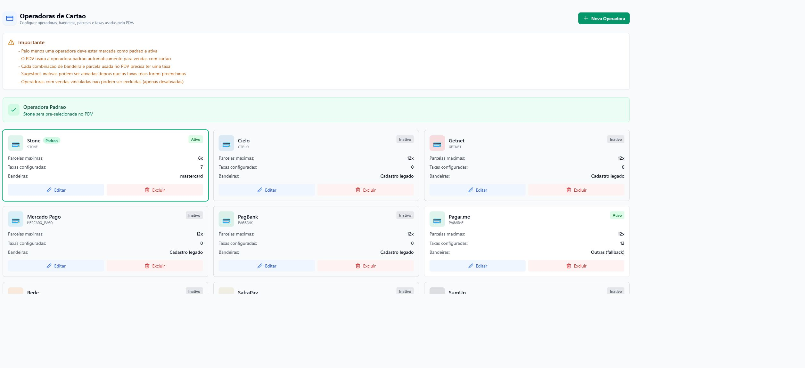
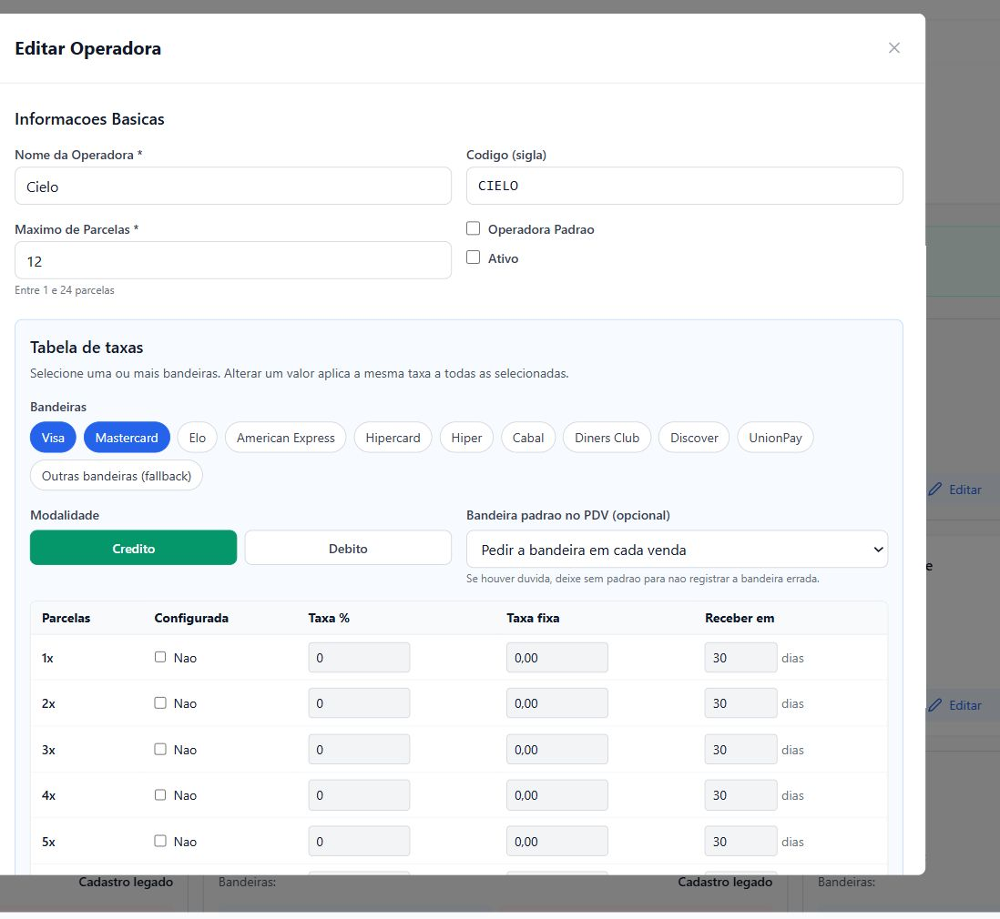
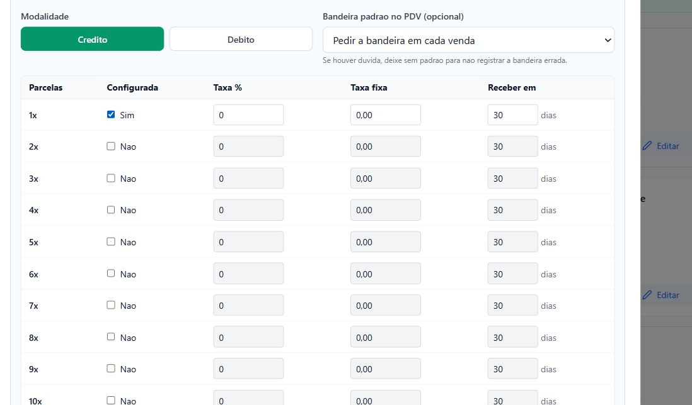

# Como configurar taxas de cartão no CorePet

Este passo a passo mostra como cadastrar corretamente as taxas de uma operadora de cartão por bandeira, modalidade e número de parcelas. Essas informações são usadas pelo PDV e pelos cálculos financeiros do CorePet.

> **Antes de começar:** tenha em mãos a tabela de taxas contratada com a operadora. Não use taxas aproximadas, pois elas afetam os cálculos financeiros do sistema.

## O que você precisa conferir no contrato

- Operadora utilizada, como Stone, Cielo, Getnet, Rede ou outra.
- Bandeiras aceitas, como Visa, Mastercard e Elo.
- Taxa do crédito para cada quantidade de parcelas.
- Taxa do débito.
- Taxa fixa por transação, se houver.
- Prazo de recebimento de cada modalidade.
- Quantidade máxima de parcelas oferecida pelo estabelecimento.

## 1. Acesse as operadoras de cartão

No menu lateral do CorePet, abra **Cadastros** e clique em **Operadoras de Cartão**.

O CorePet já apresenta as principais operadoras como sugestões. Elas permanecem inativas até que as taxas reais do estabelecimento sejam preenchidas.

Você pode:

- clicar em **Editar** em uma operadora já sugerida; ou
- clicar em **Nova Operadora** se a empresa utilizada não estiver na lista.

## 2. Preencha os dados básicos

Informe ou revise:

- **Nome da Operadora:** nome exibido no sistema.
- **Código (sigla):** identificação curta da operadora.
- **Máximo de Parcelas:** maior quantidade de parcelas que poderá ser configurada.
- **Operadora Padrão:** faz com que essa operadora seja pré-selecionada no PDV.
- **Ativo:** libera a operadora para utilização.

Se o estabelecimento usa apenas uma operadora, marque-a como **Operadora Padrão** para evitar uma seleção repetitiva em cada venda.

> Ative a operadora somente depois de conferir todas as taxas que serão utilizadas no PDV.

## 3. Selecione as bandeiras

Na seção **Tabela de taxas**, clique nas bandeiras que receberão a configuração.

- Se Visa e Mastercard tiverem as mesmas condições, selecione as duas juntas. Cada valor informado será aplicado às duas bandeiras.
- Se as condições forem diferentes, selecione e configure uma bandeira por vez.
- Você também pode agrupar outras bandeiras quando todas tiverem exatamente a mesma taxa e o mesmo prazo de recebimento.
- Use **Outras bandeiras (fallback)** apenas para cartões que não tenham uma bandeira específica cadastrada.

### Como interpretar a coluna “Configurada”

- **Não:** nenhuma das bandeiras selecionadas possui taxa naquela parcela.
- **Sim:** todas as bandeiras selecionadas possuem taxa naquela parcela.
- **1/2**, **2/3** ou semelhante: apenas parte das bandeiras selecionadas está configurada. Por exemplo, “1/2” indica que uma das duas bandeiras possui taxa e a outra ainda não.

O indicador fracionado representa uma configuração parcial; ele não divide nem altera o valor da taxa.

## 4. Configure crédito e débito

Escolha a modalidade que será preenchida:

- **Crédito:** permite configurar uma taxa diferente para cada quantidade de parcelas.
- **Débito:** possui uma única linha de configuração.

As taxas de crédito e débito são independentes. Depois de terminar uma modalidade, clique na outra e faça a conferência correspondente.

## 5. Preencha cada parcela utilizada

Para cada opção realmente oferecida pelo estabelecimento:

1. Marque a caixa da coluna **Configurada**.
2. Informe a **Taxa %** cobrada pela operadora.
3. Informe a **Taxa fixa** cobrada por transação, se houver. Caso não exista, mantenha zero.
4. Informe em **Receber em** o prazo, em dias, para o valor ficar disponível.
5. Repita o processo nas demais parcelas contratadas.

O número zero no campo de taxa não significa, sozinho, que a parcela está configurada. A caixa **Configurada** é o que determina se aquela combinação de bandeira, modalidade e parcela foi cadastrada.

Não marque parcelas que o estabelecimento não oferece aos clientes.

## 6. Defina a bandeira padrão no PDV, se necessário

O campo **Bandeira padrão no PDV (opcional)** controla a seleção da bandeira durante a venda.

- Deixe **Pedir a bandeira em cada venda** quando o operador do caixa precisar informar a bandeira do cartão utilizado. Essa é a opção mais segura quando há dúvida.
- Escolha uma bandeira padrão somente quando o processo do estabelecimento justificar essa seleção automática.

Definir uma operadora padrão não obriga a definir uma bandeira padrão. As duas configurações são independentes.

## 7. Salve e faça a conferência final

Antes de clicar em **Salvar Alterações**, confira se:

- a operadora correta foi selecionada;
- as bandeiras com taxas iguais foram agrupadas corretamente;
- as bandeiras com taxas diferentes foram configuradas separadamente;
- crédito e débito foram revisados;
- cada parcela utilizada possui taxa e prazo de recebimento;
- somente parcelas oferecidas pelo estabelecimento estão marcadas;
- existe pelo menos uma operadora ativa e padrão;
- a operadora só foi ativada depois do preenchimento completo.

Depois de salvar, abra o PDV e faça uma simulação de venda com cartão para conferir:

- se a operadora padrão aparece pré-selecionada;
- se a bandeira é solicitada ou preenchida conforme a escolha feita;
- se as modalidades e parcelas utilizadas pelo estabelecimento estão disponíveis corretamente.

Não conclua uma venda real apenas para testar. Interrompa a simulação antes da finalização.

## Dúvidas comuns

### Posso selecionar Visa e Mastercard ao mesmo tempo?

Sim. Faça isso quando taxa, prazo e condições forem iguais. Se qualquer condição for diferente, configure as bandeiras separadamente.

### Posso cadastrar apenas uma operadora?

Sim. Deixe essa operadora ativa e marque-a como padrão. O PDV fará a pré-seleção automaticamente.

### Preciso configurar todas as parcelas?

Não. Configure somente as parcelas realmente oferecidas pelo estabelecimento, mas não deixe sem taxa nenhuma combinação que será utilizada no PDV.

### Posso ativar uma sugestão com taxas zeradas e preencher depois?

Não é recomendado. Mantenha a sugestão inativa até preencher e conferir as taxas reais do contrato.

### Posso excluir uma operadora que já foi usada?

Operadoras com vendas vinculadas não podem ser excluídas. Quando não forem mais utilizadas, elas devem ser desativadas para preservar o histórico.

